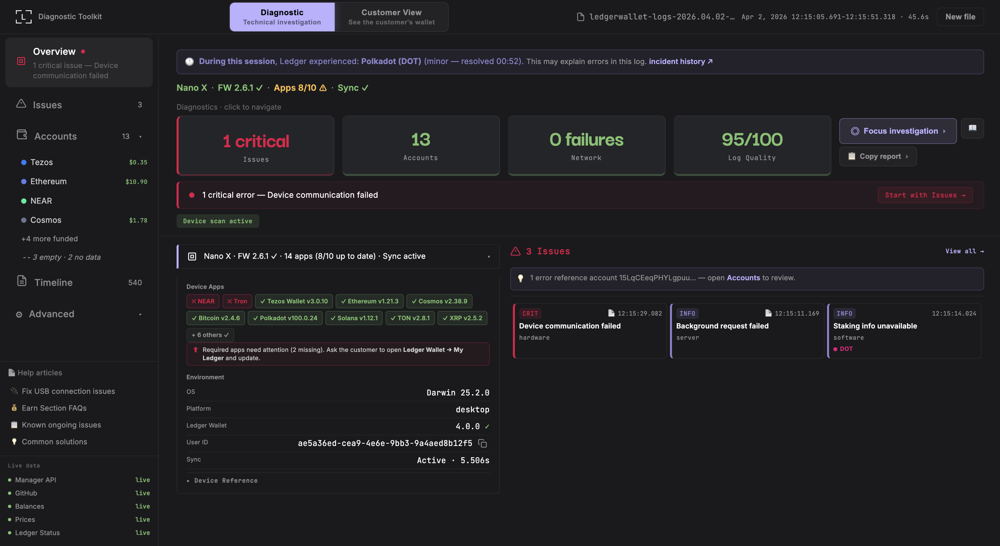

# Ledger Diagnostic Toolkit

> One-file diagnostic dashboard for Ledger customer support. Drop a log, see everything.

**[Open the tool →](https://pj-casey.github.io/ledger-toolkit/ledger-toolkit.html)** · **[Agent Guide →](https://pj-casey.github.io/ledger-toolkit/agent-guide.html)** · **[Technical Reference →](https://pj-casey.github.io/ledger-toolkit/technical-reference.html)**


---

<!-- Replace with actual screenshot: load a log, take a screenshot of the Overview, save as screenshot.png in the repo root -->


---

## What it does

A CS agent receives a Ledger Wallet log export from a customer. They drop it into this tool. In under 5 seconds they see:

- **What device** — model, firmware, installed apps with live version checks (outdated, missing, current)
- **What accounts** — live on-chain balances and fiat values fetched automatically from 40+ blockchains
- **What went wrong** — 82 error patterns diagnosed with severity, recommended actions, and common causes
- **What the customer sees** — their exact wallet view reconstructed from app.json, with balance comparison to live on-chain data
- **If they were drained** — automatic detection of account drains with fund flow visualization, attacker addresses, and forensic reports

No install. No build step. No API keys. One HTML file in a browser.

## Quick start

```
1. Open ledger-toolkit.html in any browser
2. Drag a customer's log file onto the drop zone
3. Read the diagnosis
```

Accepts `.json`, `.txt`, and `.log` files exported from Ledger Wallet (desktop or mobile).

For deeper investigation, switch to **Customer View** and load the customer's `app.json`.

## Features

### Two modes

**Diagnostic Mode** — technical investigation. Sidebar navigation, fixed viewport, everything fits in one screen.

**Customer View** — the customer's wallet as they see it. Portfolio, accounts with full transaction history, staking positions, device info, and Agent Insights diagnostic dashboard.

### Diagnostic Mode

| Section | What it shows |
|---|---|
| **Overview** | Device status line (model · firmware · apps · sync). Stat cards: Issues, Accounts, Network failures, Log Quality. Focus Investigation dropdown. Error tiles sorted by severity with linked account badges. Unified device card with app chips, environment data, and device reference popover. Ledger status incident detection. Triage guidance banner. |
| **Issues** | Interactive severity + category filter chips. Error-prominent session strip with hover tooltips. Repeating pattern badges. Master-detail error list. Breadcrumbs ("What happened before"). Diagnostic Pathways (related evidence: network failures, APDU rejections, sync activity). Help article links. Copy Errors. |
| **Accounts** | Squarified treemap (proportional to fiat value) with 6 sort modes. Health tiles with chain icons, corner dots (errors, xpub, unsupported). Live blockchain balances + fiat for 40+ chains. EVM address grouping. Token explorer links. Xpub Scanner (BTC/LTC/DOGE/BCH). Focus Mode integration. |
| **Timeline** | Stacked-bar session strip (80 buckets, TC-colored). Interactive legend chips (hover to highlight, click to filter). Error dot baseline. Brush selection (drag to zoom). Smart grouping (collapses repeated events). Account-correlated filtering. |
| **Network** | HTTP requests with status codes. Error summary header. Server vs client error breakdown. |
| **APDU** | Device communication commands. Status codes decoded (OK, Rejected, Locked). Rejection summaries. LLv4 DMK logger support. |
| **Raw JSON** | Interactive tree viewer. Progressive search with match navigation. Expand/collapse controls. Path copy. |

### Customer View

| Tab | What it shows |
|---|---|
| **Portfolio** | Total balance, asset allocation table with fiat values using the customer's cached exchange rates. dApp activity history. |
| **Accounts** | Full account list with balances, fiat values, and stars. Click for account detail: operations timeline grouped by date, token holdings with per-token operations, swap history, staking split, pending/failed transactions. |
| **Earn** | Staking positions with deposited amounts, estimated APY, rewards earned, validator names. Liquid staking tokens (stETH, JupSOL, cbETH, LBTC). Provider directory. |
| **My Ledger** | Device model, firmware version, storage bar with app sizes, app catalog with live version checks. |
| **Agent Insights** | Diagnostic dashboard comparing cached balances to live on-chain. Drain detection with fund flow visualization. Per-account findings with staking awareness. System checks (firmware, apps, countervalue drift, data confidence). |

### Focus Mode

Single-account investigation mode. Shift+click any account tile, use the Focus Investigation dropdown, or click an affected account on an error card. Every section filters to that account: Timeline shows only its events, Issues shows only its errors, non-focused elements dim to 25%. Chain-colored ambient effects signal what you're investigating. Press Escape to clear.

### Drain Detection

When Agent Insights detects that accounts have been drained (>90% balance drop with real value), it surfaces a forensic finding at the top of the list:

- **Fund flow diagram** — victim accounts on the left, attacker addresses on the right, transaction links between them
- **Multi-chain convergence** — when funds from multiple chains go to the same address, it's highlighted as a collection wallet
- **Attacker addresses** — copy buttons and direct block explorer links for every destination
- **Forensic copy report** — one-click formatted report with all transaction hashes, addresses, and explorer URLs for law enforcement escalation
- **Staking guard** — warns when balance drops on staking chains may be from delegation, not theft

### Live On-Chain Balances

Fetches balances automatically on log load. 40+ chains: all EVM (Ethereum, Polygon, BSC, Arbitrum, Optimism, Base, Linea, Scroll, zkSync…), BTC, LTC, DOGE, BCH, SOL, XTZ, XRP, ADA, NEAR, TRX, TON, ATOM, ALGO, APT, SUI, STX, XLM, HBAR, EGLD, KAS, FIL, and more. Fiat prices via CoinGecko.

### Live Version Checking

Three-phase check on log load:
1. **App catalog** — fetches current versions from Ledger Manager API. Shows ✓/⬆/✕ on every device app chip.
2. **Firmware** — checks for available firmware updates via 3-call Manager API chain.
3. **Desktop app** — checks latest release from GitHub.

### Mobile Log Support

Ledger Wallet Mobile (iOS/Android) logs fully supported. Automatic format normalization. MOBILE badge in header. No-sync amber visibility treatment.

### Copy & Export

| Format | Use case |
|---|---|
| **Quick Summary** | Ticket notes — device, top accounts, top errors, portfolio total |
| **Full Export** | Escalation — everything, all accounts, all errors |
| **Customer Summary** | Account-focused — balances and portfolio for the customer |
| **Copy Errors** | Error investigation — severity, actions, causes, help article URLs |
| **Drain Report** | Law enforcement — transaction hashes, attacker addresses, explorer links |

All formats include live balances when available. Accessible from the 📋 Copy report dropdown on the Overview action bar.

### Keyboard Shortcuts

| Key | Section |
|---|---|
| `Ctrl+1` | Overview |
| `Ctrl+2` | Issues |
| `Ctrl+3` | Accounts |
| `Ctrl+4` | Timeline |
| `Ctrl+5` | Network |
| `Ctrl+6` | APDU |
| `Ctrl+7` | Raw JSON |
| `Escape` | Clear Focus Mode |

Mac: use `⌘` instead of `Ctrl`.

## Architecture

```
ledger-toolkit.html (~8,400 lines)
├── React 18.3.1 + Babel standalone 7.26.10 (no build step)
├── bitcoinjs-lib 5.2.0 + bs58 + buffer (CDN, for xpub derivation)
├── Fixed viewport: 100vh, no page scrolling
├── Live network: public blockchain RPCs + CoinGecko + Manager API + GitHub API + status.ledger.com
└── Data layer: 82 errors · 60 chains · 45+ tx explorers · 40+ balance APIs · 23 EVM RPCs
```

Zero data transmission. All log parsing and analysis runs client-side. Only account addresses leave the browser to query on-chain balances.

## Files

| File | Purpose |
|---|---|
| `ledger-toolkit.html` | The tool — single-file React app, opens in any browser |
| `agent-guide.html` | Investigation guide for CS agents (also embedded in the tool as 📖) |
| `technical-reference.html` | Technical capabilities reference (also embedded as 🔬) |
| `CLAUDE.md` | Technical reference for AI-assisted development |
| `SESSION_HANDOFF.md` | Session context for continuity between development sessions |

## Built with

This tool is built using an AI-assisted workflow:

- **[Claude](https://claude.ai)** — architecture, design review, prompt authoring
- **[Claude Code](https://docs.anthropic.com/en/docs/claude-code)** — implementation from `.md` spec prompts
- **Branch model:** `experimental` → `main` on release
